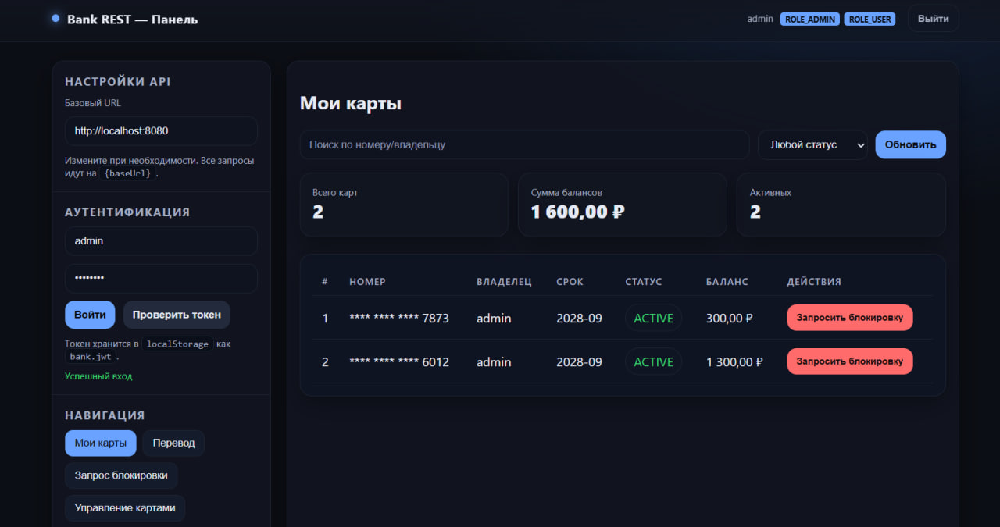

# Bank REST API



Bank REST API — это приложение для управления банковскими картами и переводами. Проект предоставляет функционал для администраторов и пользователей с учетом безопасности, удобства и масштабируемости. Построен на основе **Spring Boot** с использованием современных технологий и лучших практик.

## 🚀 Основные возможности

### Для пользователей
- **Просмотр карт**: Удобный интерфейс для просмотра своих карт с поддержкой поиска и пагинации.
- **Переводы**: Быстрые и безопасные переводы между своими картами.
- **Запрос на блокировку**: Возможность запросить блокировку карты.
- **Проверка баланса**: Мгновенный доступ к информации о балансе.

### Для администраторов
- **Управление картами**: Создание, блокировка, активация и удаление карт.
- **Управление пользователями**: Полный контроль над учетными записями пользователей.
- **Просмотр всех карт**: Доступ ко всем картам в системе.

## 🔒 Безопасность
- **Аутентификация и авторизация**: Используется **Spring Security** с **JWT** для защиты API.
- **Ролевой доступ**: Поддержка ролей **ADMIN** и **USER**.
- **Шифрование данных**: Защита конфиденциальной информации.
- **Маскирование номеров карт**: Безопасное отображение номеров карт.

## 🛠 Технологии
- **Язык**: Java 17+
- **Фреймворк**: Spring Boot, Spring Security, Spring Data JPA
- **База данных**: PostgreSQL
- **Миграции**: Liquibase
- **Контейнеризация**: Docker, Docker Compose
- **Документация**: Swagger UI / OpenAPI
- **Аутентификация**: JWT
- **Тестирование**: JUnit для юнит-тестов

## 📖 API Документация
API полностью задокументировано с использованием **Swagger UI**. Ознакомьтесь с доступными эндпоинтами и примерами запросов:

- [Swagger UI](http://localhost:8080/swagger-ui/index.html) (доступно после запуска приложения)
- Спецификация: [docs/openapi.yaml](docs/openapi.yaml)

## 🏗 Архитектура
Проект построен по принципам REST с использованием многослойной архитектуры:
- **Контроллеры**: Обработка HTTP-запросов.
- **Сервисы**: Бизнес-логика.
- **Репозитории**: Взаимодействие с базой данных через Spring Data JPA.
- **Миграции**: Автоматическое управление схемой базы данных через Liquibase.

## 📋 Требования для запуска
- **Java**: 17+
- **Maven**: Для сборки проекта
- **Docker**: Для запуска в контейнерах
- **База данных**: PostgreSQL или MySQL

## 🚀 Инструкция по запуску

### Локальный запуск
1. Склонируйте репозиторий:
   ```bash
   git clone https://github.com/vnikolaenko-dev/Bank_REST.git
   cd Bank_REST
   ```
2. Настройте переменные окружения в `application.yml`:
   ```yaml
   spring:
     datasource:
       url: jdbc:postgresql://localhost:5432/bank_db
       username: your_username
       password: your_password
   ```
3. Выполните сборку и запуск:
   ```bash
   mvn clean install
   mvn spring-boot:run
   ```

### Запуск с Docker
1. Убедитесь, что Docker и Docker Compose установлены.
2. Настройте переменные окружения в `application.yml` и  `docker-compose.yaml`
3. Запустите приложение и базу данных:
   ```bash
   docker-compose up --build
   ```
4. Приложение будет доступно по адресу: `http://localhost:8080`.

### Доступ к Swagger UI
После запуска приложения откройте в браузере:
```
http://localhost:8080/swagger-ui/index.html
```

## 🧪 Тестирование
Проект включает юнит-тесты для ключевой бизнес-логики. Для запуска тестов:
```bash
mvn test
```
